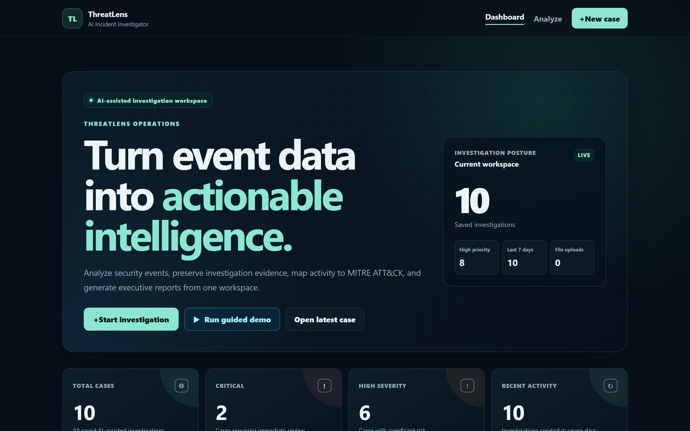
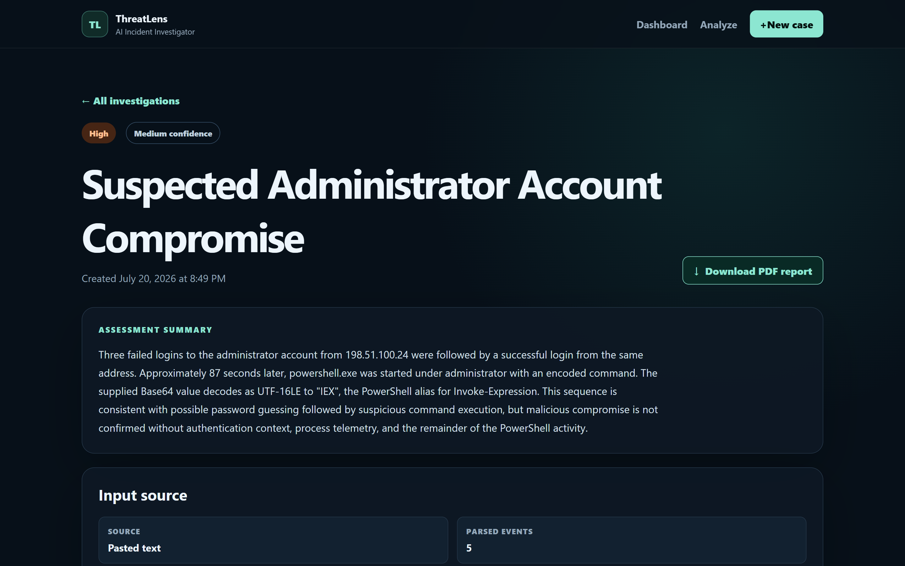
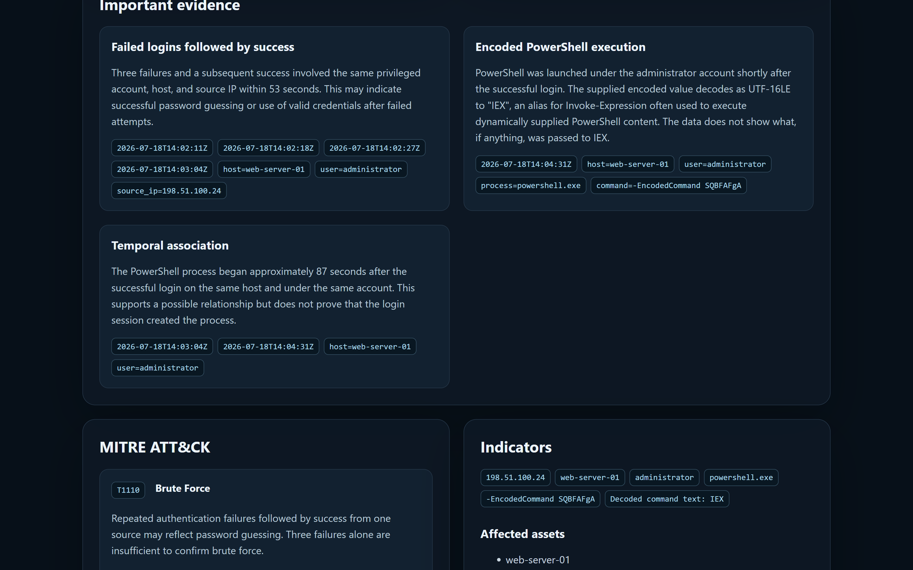
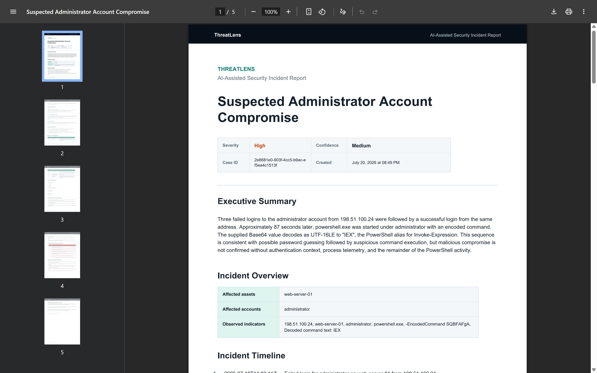

# ThreatLens

> AI-assisted security incident investigation with Django, the OpenAI
> Responses API, and validated structured outputs.

[](https://github.com/Keneni-Tech/threatlens/actions/workflows/django-ci.yml)
[](https://www.python.org/)
[](https://www.djangoproject.com/)
[](LICENSE)

ThreatLens turns sanitized security events into structured, saved, and
reportable incident assessments. It is an OpenAI Build Week 2026
Developer Tools submission designed to help analysts organize evidence
quickly while keeping a human responsible for every conclusion and
response action.



## What ThreatLens does

- Accepts pasted logs or TXT, LOG, JSON, JSONL, and CSV uploads
- Validates file extension, reported MIME type, size, encoding, and structure
- Normalizes event data before analysis
- Uses GPT-5.6 through the OpenAI Responses API
- Validates responses against strict Pydantic models
- Produces severity, confidence, evidence, timeline, indicators, affected
  assets and accounts, recommendations, containment actions, and limitations
- Maps observed behavior to MITRE ATT&CK techniques
- Saves investigations with input provenance
- Searches, filters, sorts, and paginates investigation history
- Generates executive PDF reports without making another AI request
- Provides a deterministic guided demo that consumes no API credits
- Includes request IDs, health checks, secure production settings, and CI

## Product tour

<p align="center">
  
  
</p>

<p align="center">
  
</p>

```text
Paste or upload events
        ↓
Validate and normalize
        ↓
Analyze with GPT-5.6
        ↓
Validate structured output
        ↓
Save and review investigation
        ↓
Search, revisit, or export PDF
```

AI output is decision support, not an autonomous security decision.
ThreatLens never executes containment actions.

## Technology

- Python 3.13
- Django 6.0
- OpenAI Python SDK and Responses API
- GPT-5.6, configurable through `OPENAI_MODEL`
- Pydantic structured outputs
- SQLite for the MVP
- Django templates, custom CSS, and progressive JavaScript
- ReportLab and pypdf for PDF generation and verification
- Gunicorn and WhiteNoise for deployment

## Quick start

### 1. Clone and create an environment

```bash
git clone git@github.com:Keneni-Tech/threatlens.git
cd threatlens
python -m venv .venv
```

Activate the environment:

```powershell
# Windows PowerShell
.\.venv\Scripts\Activate.ps1
```

```bash
# macOS or Linux
source .venv/bin/activate
```

### 2. Install and configure

```bash
python -m pip install --upgrade pip
pip install -r requirements.txt
```

Copy the development configuration:

```powershell
# Windows PowerShell
Copy-Item .env.example .env
```

```bash
# macOS or Linux
cp .env.example .env
```

The checked-in example is configured for local development. Add an
`OPENAI_API_KEY` to `.env` only when testing live AI analysis. The guided
demo and automated tests do not require a working API key.

### 3. Initialize and run

```bash
python manage.py migrate
python manage.py seed_demo
python manage.py runserver
```

Open:

- Dashboard: `http://127.0.0.1:8000/`
- New investigation: `http://127.0.0.1:8000/investigations/new/`
- Health check: `http://127.0.0.1:8000/health/`
- Django admin: `http://127.0.0.1:8000/admin/`

Sample event files are available in [`samples/`](samples/).

## Guided demo

With `THREATLENS_DEMO_MODE=True`, select **Run guided demo** on the
dashboard or run:

```bash
python manage.py seed_demo
```

The command is idempotent: it creates the fictional demonstration case
once and reports the existing case on subsequent runs. It does not call
OpenAI or consume API credits.

See the [three-to-four-minute demo script](docs/DEMO_SCRIPT.md) and
[screenshot checklist](docs/SCREENSHOTS.md).

## Configuration

| Variable | Development default | Purpose |
| --- | --- | --- |
| `DJANGO_SECRET_KEY` | development placeholder | Django signing secret; replace in production |
| `DJANGO_DEBUG` | `True` | Enables Django development diagnostics |
| `DJANGO_ALLOWED_HOSTS` | localhost addresses | Comma-separated accepted hosts |
| `DJANGO_CSRF_TRUSTED_ORIGINS` | empty | Comma-separated trusted HTTPS origins |
| `DJANGO_SECURE_SSL_REDIRECT` | `False` | Redirect HTTP to HTTPS in production |
| `DJANGO_TRUST_X_FORWARDED_PROTO` | `False` | Trust a correctly configured reverse proxy |
| `DJANGO_SECURE_HSTS_SECONDS` | `3600` | HSTS duration when production settings apply |
| `DJANGO_LOG_LEVEL` | `INFO` | Application and Django console log level |
| `OPENAI_API_KEY` | empty | OpenAI credential for live analysis |
| `OPENAI_MODEL` | `gpt-5.6` | Model sent to the Responses API |
| `OPENAI_MAX_RETRIES` | `2` | SDK retry count |
| `THREATLENS_DEMO_MODE` | `True` | Enables deterministic demo creation |
| `THREATLENS_MAX_UPLOAD_BYTES` | `5242880` | Maximum uploaded file size |
| `THREATLENS_MAX_INPUT_CHARACTERS` | `30000` | Maximum pasted input length |
| `THREATLENS_MAX_PARSED_CHARACTERS` | `200000` | Maximum normalized analysis input |
| `THREATLENS_ANALYSIS_TIMEOUT_SECONDS` | `90` | OpenAI request timeout |

## Testing and quality checks

```bash
python manage.py check
python manage.py makemigrations --check
python manage.py test
python manage.py collectstatic --noinput
python -m pip check
node --check analyzer/static/analyzer/app.js
```

CI additionally runs Django deployment checks and `pip-audit`.

## Deployment

ThreatLens includes `start.sh` and a `Procfile` for Linux-based hosting.
Before deployment:

1. Generate a unique production secret:

   ```bash
   python -c "from django.core.management.utils import get_random_secret_key; print(get_random_secret_key())"
   ```

2. Set `DJANGO_DEBUG=False`, production hosts, trusted CSRF origins, and
   HTTPS settings.
3. Set `DJANGO_TRUST_X_FORWARDED_PROTO=True` only when the trusted proxy
   strips client-supplied forwarding headers and sets the protocol header.
4. Enforce an upload-body limit at the reverse proxy.
5. Run `python manage.py check --deploy`.

The current MVP uses SQLite and has no application-level investigation
authentication or tenant isolation. Deploy it only in a controlled
single-user environment with sanitized data. See the complete
[deployment and security checklist](docs/DEPLOYMENT.md).

## Project documentation

- [Architecture](docs/ARCHITECTURE.md)
- [Deployment checklist](docs/DEPLOYMENT.md)
- [Demonstration script](docs/DEMO_SCRIPT.md)
- [Screenshot checklist](docs/SCREENSHOTS.md)
- [Sample event guide](samples/README.md)
- [Roadmap](ROADMAP.md)
- [Contributing](CONTRIBUTING.md)
- [Security policy](SECURITY.md)
- [Code of conduct](CODE_OF_CONDUCT.md)

## Responsible use

Only submit fictional, sanitized, or properly authorized security data.
Never submit passwords, private keys, authentication tokens, API keys,
customer secrets, or unnecessary personal information.

AI assessments may be incomplete or incorrect. Analysts must validate
the evidence, MITRE mappings, severity, recommendations, and containment
actions before using them operationally.

## License

ThreatLens is available under the [MIT License](LICENSE).
