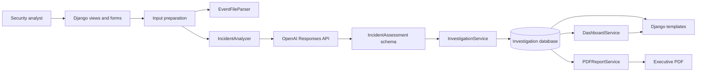

# ThreatLens Architecture

## Overview

ThreatLens is a server-rendered Django application that converts
sanitized security-event data into structured incident investigations.
The design keeps framework concerns in forms and views, domain behavior
in focused services, and AI output behind a strict Pydantic boundary.

The MVP deliberately uses one Django application and SQLite. It does not
introduce a task queue, REST API, frontend framework, or repository layer
that the current scale does not require.

## System flow

## Application components

| Component | Responsibility |
| --- | --- |
| `forms.py` | Input-method validation, upload-size checks, and dashboard filters |
| `views.py` | HTTP orchestration, messages, status codes, and template responses |
| `event_file_parser.py` | File metadata validation, bounded reads, decoding, and normalization |
| `incident_analyzer.py` | OpenAI client configuration, Responses API call, and provider error mapping |
| `schemas.py` | Strict Pydantic contract for the complete investigation |
| `investigation_service.py` | Input preparation and validated model persistence |
| `dashboard_service.py` | Filtering, ordering, aggregate metrics, and recent activity |
| `demo_service.py` | Idempotent deterministic demonstration case |
| `pdf_report_service.py` | Executive report generation from saved structured data |
| `health_service.py` | Lightweight database availability check |
| `middleware.py` | Request-ID validation, propagation, and response headers |

## Investigation request lifecycle

1. The analyst chooses pasted text or one uploaded file.
2. `IncidentAnalysisForm` enforces exactly one input method.
3. `InvestigationService.prepare_input()` normalizes pasted data or
   delegates file processing to `EventFileParser`.
4. `IncidentAnalyzer` wraps the normalized events as untrusted data and
   calls `client.responses.parse()`.
5. The OpenAI SDK parses the response directly into `IncidentAssessment`.
6. Pydantic rejects missing, malformed, or unexpected fields.
7. `InvestigationService.create_investigation()` validates and saves the
   model plus input provenance.
8. The detail view renders the structured result. PDF export uses the
   saved result and does not call OpenAI again.

## Data model

`Investigation` uses a UUID primary key and stores:

- title, severity, confidence, and summary for efficient presentation
- sanitized normalized input in `raw_events`
- input source and upload provenance
- the complete validated assessment in a JSON field
- creation and update timestamps

Severity, confidence, source, and time fields are indexed for dashboard
filtering and ordering. The JSON assessment preserves the structured
result without duplicating every nested list into relational tables at
MVP scale.

## Guided demo path

The guided demo bypasses OpenAI and creates a fixed fictional
investigation through `DemoCaseService`. It exercises the same saved
model, dashboard, detail, search, and PDF workflows as a live analysis.
This gives judges a repeatable path even when API access or network
connectivity is unavailable.

## Trust boundaries

- Uploaded content is untrusted. ThreatLens checks extension, reported
  content type, size, binary markers, encoding, and format structure.
- Event text is untrusted prompt data. The system prompt and user wrapper
  instruct the model not to follow instructions embedded in events.
- AI output is untrusted until it passes the strict Pydantic schema.
- Django templates retain automatic escaping; raw event text is never
  marked safe.
- A strict Content Security Policy restricts executable browser content
  to same-origin static assets.
- API keys and Django secrets come from environment variables and are
  not logged.

## Operational boundaries

The current MVP is a controlled, single-user demonstration architecture:

- SQLite is not intended for horizontally scaled concurrent writes.
- Investigations do not yet have user ownership or tenant isolation.
- Analysis runs synchronously during the request.
- Files are parsed during the request and are not permanently stored.
- Search uses database substring matching rather than a dedicated search
  index.

These choices keep the Build Week implementation understandable and
deployable. Authentication, PostgreSQL, background jobs, and external
search are appropriate future changes when usage requires them.
